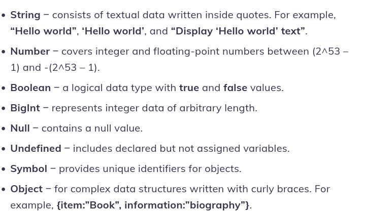
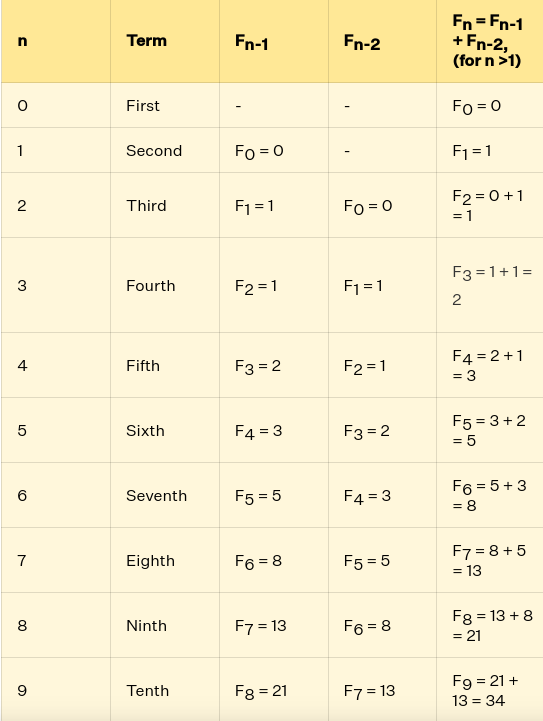
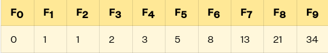
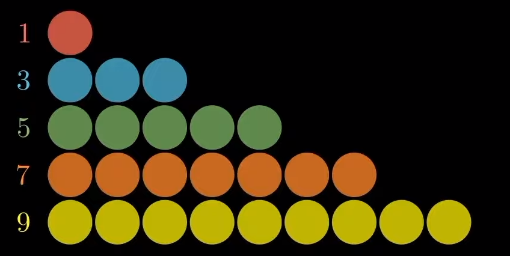
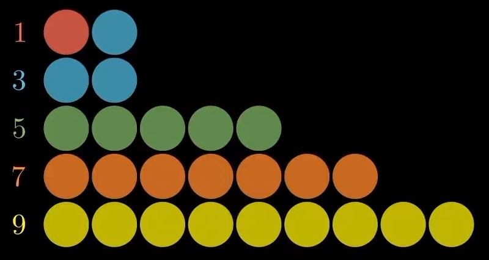
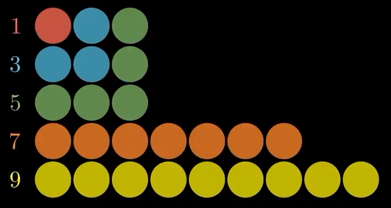
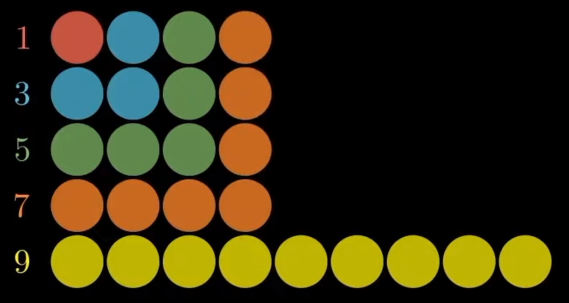
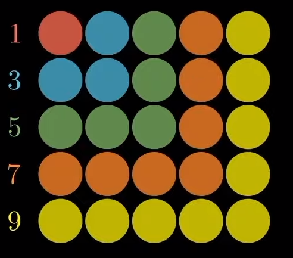
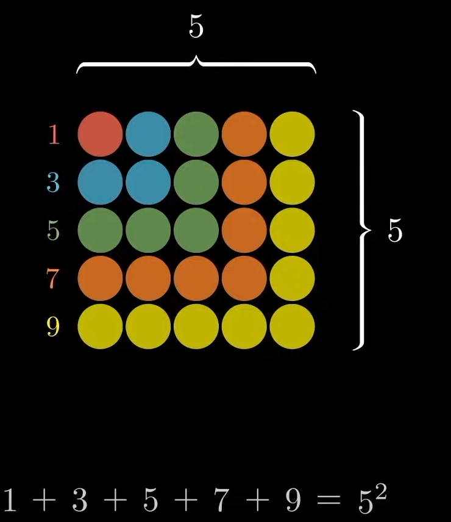
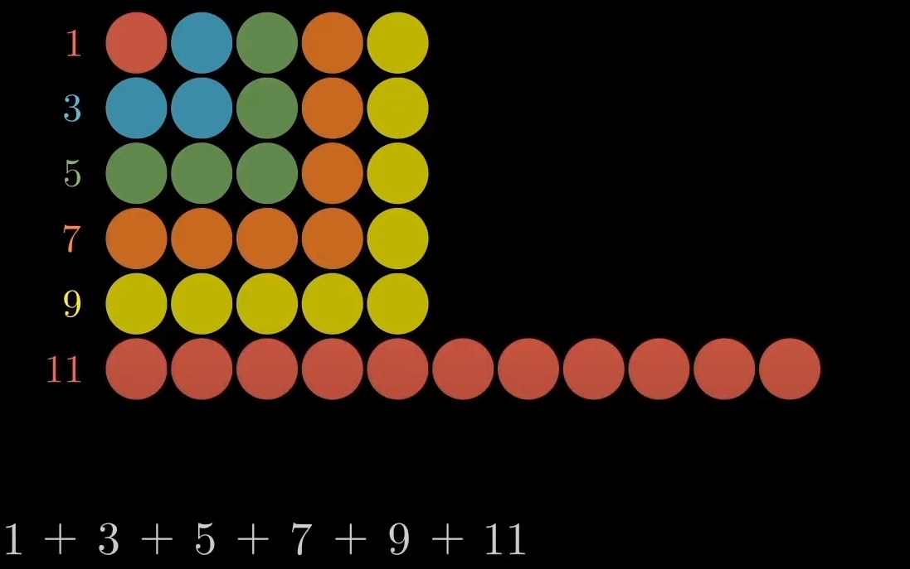

# WHAT IS ?


#### JavaScript was invented by Brendan Eich in 1995. It was developed for Netscape 2, and became the ECMA-262 standard in 1997.


#### JS
>[!TIP]
>JavaScript is a scripting or programming language that allows you to implement complex features on web pages---every time a web page does more than just sit there and display static information for you to look at `i mean it will not update that page` And also whant to explain that JavaSript can't work without HTML and CSS 

* `HTML` is the markup language that we use to structure and give meaning to our web content, for example defining paragraphs, headings, and data tables, or embedding images and videos in the page.
* `CSS` is a language of style rules that we use to apply styling to our HTML content, for example setting background colors and fonts, and laying out our content in multiple columns.
* `JavaScript` is a scripting language that enables you to create dynamically updating content, control multimedia, animate images, and pretty much everything else. (Okay, not everything, but it is amazing what you can achieve with a few lines of JavaScript code.)

if you whant to gain more information about this programming language you can follow to this <a href="https://developer.mozilla.org/en-US/docs/Learn/JavaScript/First_steps/What_is_JavaScript">Web</a> <a href="https://developer.mozilla.org/en-US/docs/Learn/JavaScript/First_steps/What_is_JavaScript">Page</a>

>JavaSript Является реализацией спецификации ECMAScript (стандарт ECMA-262[2]).      

>[!TIP]
> in JavaSript we have got 3 kind of keywords
`var` `let` and `const`


>[!TIP]

in JS we have got 7 primitives and more over objects
```js
undefined
null
number
string
booleon
symbol
bigInt
```

it was primitives in JS 
>

>Operators in JavaScript
``` js
+ 	Addition
- 	Subtraction
* 	Multiplication
** 	Exponentiation (ES2016)
/ 	Division
% 	Modulus (Division Remainder)
++ 	Increment
-- 	Decrement
```
```js
Operator     Examples          Same As
=             x = y 	        x = y
+= 	      x += y 	        x = x + y
-= 	      x -= y 	        x = x - y
*= 	      x *= y 	        x = x * y
/= 	      x /= y 	        x = x / y
%= 	      x %= y 	        x = x % y
**= 	      x **= y 	        x = x ** y
```

>JavaScript Comparison Operators
Operator 	Description
``` js
== 	equal to
=== 	equal value and equal type
!= 	not equal
!== 	not equal value or not equal type
> 	greater than
< 	less than
>= 	greater than or equal to
<= 	less than or equal to
? 	ternary operator
```

>JavaScript Logical Operators
Operator 	Description

``` js
&& 	logical and
|| 	logical or
! 	logical not
```

>
JavaScript Type Operators
Operator 	Description
``` js
typeof 	Returns the type of a variable
instanceof 	Returns true if an object is an instance of an object type
```


>[!TIP]
>The `if/else` statement executes a block of code if a specified condition is true. If the condition is false, another block of code can be executed. The if/else statement is a part of JavaScript's `"Conditional"` Statements, which are used to perform different actions based on different conditions.


```js
function condition(a) {
    if(a<=14){
        return "Sorry but you are not to old"
    }
    else{
        return "Yes you are exist"
    }
}
console.log(condition(6));//Sorry but you are not to old
```

>[!TIP]
>The conditional (ternary) operator is the only JavaScript operator that takes three operands: a condition followed by a question mark ( ? ), then an expression to execute if the condition is truthy followed by a colon ( : ), and finally the expression to execute if the condition is falsy.

``` js
function condition(a) {
    return a<=14 ? "Sorry but you are not to old" : "Yes you are exist"
}
console.log(condition(6));//Sorry but you are not to old
```

>[!TIP]
>The switch statement `executes a block of code depending on different cases`. The switch statement is a part of JavaScript's "Conditional" Statements, which are used to perform different actions based on different conditions. Use switch to select one of many blocks of code to be executed.

``` js
let expr = 'Papayas';
switch (expr) {
  case 'Oranges':
    console.log('Oranges are $0.59 a pound.');
    break;
  case 'Mangoes':
  case 'Papayas':
    console.log('Mangoes and papayas are $2.79 a pound.');
    // Expected output: "Mangoes and papayas are $2.79 a pound."
    break;
  default:
    console.log(`Sorry, we are out of ${expr}.`);
}
```

>[!TIP]
>for - loops through a block of code a number of times. for/in - loops through the properties of an object. for/of - loops through the values of an iterable object. while - loops through a block of code while a specified condition is true.
and hep here i said something about `for/in` it we will learn about it in object


```js
function condition(a) {
    let cnt=0
    for(let i=0; i<=a; i++){
         cnt+=i
    }
    return cnt
}
console.log(condition(6));//21
```

>while and do-while in doing the same thing in like a for in JS `they create loop`

>[!TIP]
>Function Declaration in JS
``` js
function declaration(a,b) {
    return a+b
}
console.log(declaration(2,3));//5
```

>[!TIP]
>Function Expression (Arrow)
``` js
let a=(a)=>{
    return a+1
}
console.log(a(4));//5
```

>[!TIP]
>Function Expression (Anonymous)
``` js
let anon = function() {
  alert('I am anonymous');
}
anon(); //This is anonymous function
```
>[!TIP]
>IIFE (Immediatly invoked function expression)
``` js
(function() {
let numb = 4 + 4;
console.log(numb);
})();//8
```


# Fibonacci Numbers
#### Fibonacci 
#### Fibonacci raqam avalani bor dar Hinduston soxta wuda bud 200 sol PC (pew az millod) lekin yak waxsi Itoliyoi Leonardo Pisano Fibonacci (1170–1240 yo 1250 murd) wai Fibonacciro ba jaxon introduce kard wa inro Arabic number paydarpayi menomidand (poryadok) Fibonacci-ro xamchun dar nature dar priroda istifoda mebarand (meguyand ki tabiat az Fibonacci vobasta ast) baroi chi nomwa Fibonacci monday? baroi on ki bo zaboni Itoliyoi “filius Bonacci” mewavad dar Itoliyoi in nom manoi pisari Bonachi menomand yo agar kak prozvishe `udacha`  meguyand

>[!TIP]
>Fibonacci numbers — это последовательность целых чисел, которая `начинается с 0 и 1`. Каждое следующее число в последовательности является `суммой двух предыдущих чисел`.Вот некоторые примеры чисел в последовательности: `0, 1, 1, 2, 3, 5, 8, 13, 21, 34` и так далее.Fibonacci numbers были впервые обнаружены итальянским математиком Леонардо Фибоначчи в 13 веке.
>


#### Vot eto tip fibonacci primer ot 0 do 9

AS WE SAID IN THE TOP `Числа Фибоначчи — это последовательность чисел, где каждое число является суммой двух предыдущих чисел` XAR YAK 2 RAQAMI PEWINA BA YAKDIGAR JAM MEWAVAND

>iF SOMEONE TOLD YOU THA FIBONSCCI OF 5 IS 5 YOU CAN PROVE IT
>


>AND WILL WORK LIKE THIS
>

>tHEN
>

>LIKE IN THE MIDDLE
>


>IN THE END
>






RIGHT NOW YOU LEARNED HOW TO SOLVE TASKS BY THAT WE NEED TO KNOW MORE INFORMATION ABOUT FIBONACCI number <a href="https://youtu.be/r3BjNKfQaR0?si=I9b9qyw9UScnPruM">go to this link and learn</a>


<h2>What are <span style="color:pink">Hoisting</span> and <span style="color:pink">Scope</span> in JavaScript?</h2>


####  Podnytaie ili Hoisting - eto mekhanizm v JS, v kotorom peremenie i obyavlennie function-i peredvigaytsya vverkh ⬆️ `yanne vaqte ki kodi mo ba bolo meravad dar oblast vidimost pesh az on ki kod ijro karda meshavad`

>[!TIP]
>hoisting yane boloravi dar `function declaration` dar lyuboi moment kor mekunda chi mo functionro dar bolo faryod kunem chi dar tag ammo dar `function expression` va `IIFE` mo tanxo dar poyon Hoisting karda metavon chun ki `TypeError and ReferenceError` medixad
:Misol

``` js
console.log(expression(2,2));//ReferenceError: Cannot access 'declaration' before initialization
let expression=function(a,b){
    return a*b
}
```

>[!TIP]
>ammo dar `function declration` hoisting mewavad 

:Misol

``` js
function declration(a,b) {
    return a*b
}
console.log(declration(2,2));//4
```

# 👀 Рассмотрим следующий пример:


```js
var myname = "John";
function fn() {
  console.log(myname);
  var myname = "Tom";
  console.log(myname);
}

fn();

// undefined
// Tom
```

>[!TIP]
>`var имеет область действия функции;
объявления var поднимаются, но не инициализируются.`

```js
console.log(name); // undefined
var name = "Alex";//baroi chi underfined baroi on ki in var hast hamewa hoist meshavad ammo dar tori var log nameshavad
```
```js 
var name;
console.log(name); // undefined
name = "Alex";
```
 # const and let 

>[TIP]
# const и let имеют область видимости блока.

```js
{
  console.log ( x )
  // [ временная мёртвая зона ][tdz][temporarl dead zone]
  let x = 10 // Объявленные с помощью let, будут недоступны до тех пор, пока выполнение кода не дойдёт до места фактического объявления переменной
}
```
# farqitawon dar in jo faxmonda wudaast
```js
console.log(a); // undefined
var a = 1;

console.log(b); // ReferenceError: Cannot access 'b' before initialization
let b = 2;

console.log(c); // ReferenceError: Cannot access 'c' before initialization
const c = 5;
```


<h2 style="color:yellow">Введение в JavaScript SCOPE</2>
<h6 style="color:brown">scope in oblast vidimosti dar JS meboshad</h6>


* Область видимости или Scope
* Глобальная область видимости или Global Scope
* Локальная область видимости или Local Scope
* Область видимости функции
* Область видимости блока
* Лексическая область видимости
* Динамическая область видимости

``` diff
-Область видимости (scope) определяет видимость или доступность переменной (другого ресурса) в области твоего кода.
```
```js

var num = 5;
console.log(num);   // 5

function getNum(){
  console.log(num); // num доступен здесь
}

getNum();           // 5 i chiz faqat var da mumkinai digaroda ne⬆️
```
 

# ⬆️   i GLOBAL SCOPE ai 


#### dar js mo dorem
# module scope
# block scope
# function scope
# global scope 

#### local scope peremennixoi daruni function a megan `local ni oblast megan ujara xar yak function oblast vidimosti xcha dora` ``Одна и та же переменная может использоваться в разных функциях, поскольку они связаны с соответствующими функциями и не являются взаимно видимыми.`yak peremenira dar chand funtion istifoda burda meshiday`


``` js
// Глобальная область

function foo1(){
    // Локальная область 1
  function foo2(){
    // Локальная область 2
  }
}

// Глобальная область
function foo3(){
  // Локальная область 3
}

// Глобальная область
```

>Локальная область видимости может быть разделена на область видимости функции и область видимости блока. Концепция область видимости блока или block scope была представлена в ECMAScript6 (ES6) вместе с новыми способами объявления переменных - const и let.

# Область видимости функции
> var a function scope am megan baroi on ki var lyuboijo rafta metona lekin var-a tolko function qapida metona

``` js
function foo(){
  var num = 10;
  console.log('inside function: ', num);
}

foo();                   // inside function: 10
console.log(num);       // ReferenceError: num is not defined
```

if for block scope
